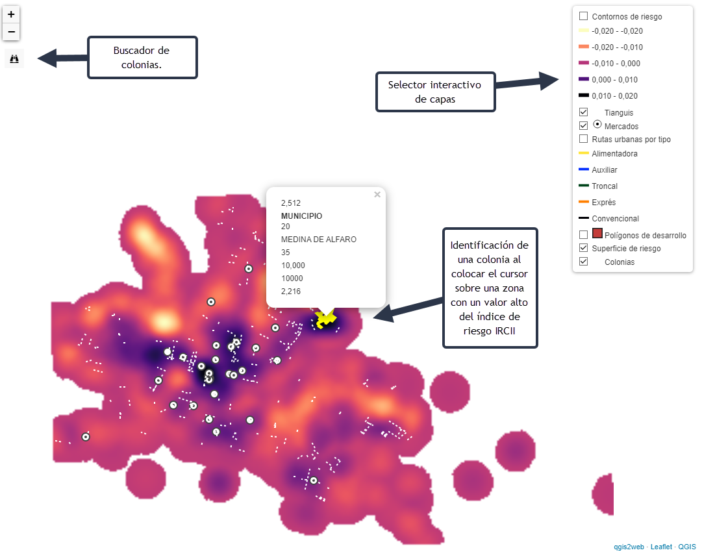

## Portafolio de proyectos Sebastián Vargas.

### COVID-19 en León, Guanajuato. Expresión cartográfica del Índice de Riesgo de Contagio Interurbano e Intergeneracional (IRCII).
#### En colaboración con el Dr. José Luis Coronado Ramírez y el Dr. Ernesto Cervantes López.

Instrumento de carácter cuantitativo que tuvo por finalidad identificar zonas con diferente intensidad de riesgo de contagio para la ciudad de León, Guanajuato, en el marco de la pandemia global de COVID-19, provocada por el virus SARS-COV2. Dicho instrumento, en forma de índice compuesto, se construye a partir de la combinación de diferentes factores de riesgo, tales como las oportunidades de movilidad en transporte público, la disponibilidad y concentración de establecimientos esenciales, la interacción entre diferentes grupos etarios, la densidad poblacional, y la disponibilidad de agua entubada. Partiendo de que el riesgo es omnipresente, la cartografía de este índice permite distinguir de diferentes zonas de la ciudad en función de su grado de riesgo de contagio.

Al deslizar el cursor por el mapa, se ilumina e identifica la colonia señalada por el cursor, permitiendo notar si ésta se encuentra en una zona de muy alto riego (zonas oscuras) o de riesgo bajo (zonas claras). También cuenta con un buscador para escribir el nombre de la colonia de interés.

### Teledetección y Análisis de Uso de Suelo en León, Guanajuato.

En este proyecto se abordo retrospectivametne la expansión de la ciudad de León, contrastando el crecimiento del entorno construido y el suelo urbano con el crecimiento de la población desde 1980 hasta el 2020, divido en cortes de 20 años. En este mapa interactivo se incluyen los parques industriales dentro del municipio, poniendo en relieve que no hay una correspondacia directa, en términos geográficos, entre las zonas de la ciudad que han mostrado mayor crecimiento, y aquellas en donde se han instalado actividades industriales. De esta forma, se sugiere que el entorno construido de la ciudad crece a más velocidad y con más envergadura que la población misma, aunque esto no se traducen en que existan más oportunidades de vivienda, trabajo y servicios para ésta.

### Concentración y distribución de servicios públicos gubernamentales en León, Guanajuato.

Este material cartográfico permite hacer notar las diferencias en la distribución y orientación de diferentes tipos de servicios gubernamentales, en combinación con las características socioeconómicas de la población. Los resultados proveen evidencia de que estos servicios han tendido a la concentración en zonas de la ciudad, en detrimento de las zonas de la ciudad en donde se detectan más privaciones en términos socioeconómicos.
