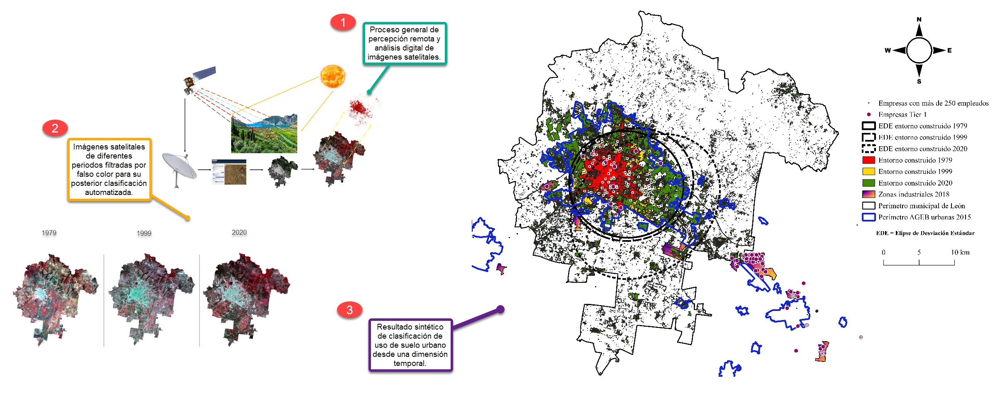

## Por Sebastián Vargas 
<sub>Maestro en Estudios para el Desarrollo [UG] / Maestrante en Geografía [Instituto de Geografía-UNAM] / Doctorando en Ciudad, Territorio y Planificación Sostenible (Universidad de Málaga)<sub>

### COVID-19 en León, Guanajuato. Expresión cartográfica del Índice de Riesgo de Contagio Interurbano e Intergeneracional (IRCII).
#### En colaboración con el Dr. José Luis Coronado Ramírez y el Dr. Ernesto Cervantes López.

Instrumento de carácter cuantitativo y [*traducido en cartografía web interactiva*](https://coremas.github.io/IRCII_2/) que tuvo por finalidad identificar zonas con diferente intensidad de riesgo de exposición al contagio del virus SARS-COV2 para la ciudad de León, Guanajuato, en el marco de la pandemia global de COVID-19. Dicho instrumento, en forma de índice compuesto, se construyó a partir de la combinación de diferentes factores de riesgo, derivados de las medidas no médicas, tales como:

<ol>
 <li>las oportunidades de movilidad en transporte público,</li> 
 <li>la disponibilidad y concentración de establecimientos esenciales,</li> 
 <li>la interacción entre diferentes grupos etarios,</li> 
 <li>la densidad poblacional,</li> 
 <li>la disponibilidad de agua entubada,</li>
 <li>la cantidad de escuelas (considerado posteriormente),</li>
 <li>la cantidad de tiendas departamentales (considerado posteriormente; sólo para temporada decembrina).</li>
</ol>
 
Partiendo de que el riesgo es omnipresente, la cartografía de este índice permite distinguir diferentes zonas de la ciudad en función de su grado de riesgo de exposición al virus, y con ello, de contagio del mismo.

Al deslizar el cursor por el mapa, se ilumina e identifica la colonia señalada por el cursor, permitiendo notar si ésta se encuentra en una zona de muy alto riego (zonas oscuras) o de riesgo medio (zonas claras), dado que sería demasiado optimista suponer un riesgo bajo. También cuenta con un buscador para escribir el nombre de una colonia de interés, y otro buscador para escuelas. [*Este artículo*](https://github.com/coremas/Coremas/blob/5719854e37fa8611bffa809f4b02c999ea0b9c0b/Vargas,%20Coronado%20y%20Cervantes%20-%20IRCII.pdf) brinda más detalles conceptuales, metodológicos y técnicos sobre los indicadores, la construcción del índice compuesto y su transformación cartográfica.
 
<div style="text-align:center">
 <iframe width="1200" height="400"
            style="border: 2px solid #69561B; width: 1200px; height: 700px; position:centered"
            src="https://geobide.org/COVID19_Leon/">
 </iframe>
</div>

<p>El siguiente Análisis de Componentes Principales aplicado al conjunto de indicadores utilizados en la construcción del índice pone en relieve aquellos asociados con la vulnerabilidad, por un lado, y con la exposición, por el otro, y que cada uno de estos grupos se presentan en áreas censales (AGEB) específicas. Así, las zonas con más escuelas, comercios y rutas de transporte serían las de mayor exposición; mientras que aquellas con un porcentaje de viviendas sin agua entubada más alto, serían más las más vulnerables, aunque no las más expuestas. Es de notarse que ni la densidad poblacional (como indicador de exposición) ni la diversidad etaria (como indicador de vulnerabilidad) se asocian con el resto de los indicadores.</p>
 

 
<p>A pesar del bajo porcentaje de varianza explicado por los dos primeros componentes principales, el resultado parece confirmar la percepción de que el virus se propaga en las zonas de mayor actividad económica, sin que necesariamente sea allí en donde los brotes son más dañinos. Por el contrario, la gente de las zonas deprimidas, aunque no encuentra muchos factores de exposición en la inmediatez de su entorno, se ve en mayor riesgo dado que está forzada a transitar por las zonas de mayor exposición, pues en sus inmediaciones no encuentran los satisfactores necesarios para su vida. Sin embargo, para dar soporte a esta hipótesis, se necesitaría acceso a los casos por área censal, los cuales, o no se generan o no son públicos.</p>
 
<p> El ACP fue realizado con el siguiente bloque de código en R. </p>

```{r}
 
library(ggplot2)
library(ggfortify)
library(factoextra)

df <- subset(IRCII_Indicadores_2022, select = -c(GMU))

pca <- prcomp(df, center = TRUE, scale = TRUE)

fviz_pca_biplot(pca, label = "var", 
                habillage = IRCII_Indicadores_2022$GMU,
                legend.title = "Grado de Marginación Urbana",
                palette = c("orange", "green", "yellow", "red", "green4"),
                addEllipses=TRUE, ellipse.level=0.95,
                title = "Análisis de Componentes Principales",
                ggtheme = theme_classic())

``` 
 
<p>NOTA 1: Este mapa interactivo fue actualizado para incluir a las diferentes escuelas de todos los niveles, públicas y privadas, en el marco del regreso a clases presenciales.</p>
<p>NOTA 2: el ACP no fue contemplado en la propuesta original, y se realizó para actualizar este ejercicio con una técnica estadística distinta a la empleada.</p>

___
 
### Tablero interactivo Power BI sobre lesiones a nivel nacional para el 2021 con datos de la Secretaría de Salud.
 
El siguiente es un ejemplo de tablero interactivo que permite visualizar de forma dinámica el comportamiento de las lesiones registradas por la SSA a nivel nacional, en función del tiempo, ubicación geográfica y de otras variables sociodemográficas, en atención a los tres aspectos clave de toda enfermedad o padecimiento en epidemiología: tiempo, lugar y persona.
 
Los datos originales pueden ser obtenidos del [*repositorio de datos abiertos de la Secretaría de Salud*](http://www.dgis.salud.gob.mx/contenidos/basesdedatos/da_lesiones_gobmx.html).
 
<iframe title="Lesiones_2021 - Página 1" width="600" height="373.5" src="https://app.powerbi.com/view?r=eyJrIjoiNjYxZDVkNTEtNzIwNC00MGVmLWE2NGUtMTUzYzlmYmNmODAyIiwidCI6ImRiMTBiZDllLWQ3NjAtNDE0YS1iYzA3LTkxMTQ4YWIxZmMwYSJ9" frameborder="0" allowFullScreen="true"></iframe>

___ 

### Teledetección y Análisis de Uso de Suelo en León, Guanajuato.

En este proyecto se abordo retrospectivametne la expansión de la ciudad de León, contrastando el crecimiento del entorno construido y el suelo urbano con el crecimiento de la población desde 1980 hasta el 2020, divido en cortes de 20 años. En el producto cartográfico se incluyen los parques industriales dentro del municipio, poniendo en relieve que no hay una correspondacia directa, en términos geográficos, entre las zonas de la ciudad que han mostrado mayor crecimiento, y aquellas en donde se han instalado actividades industriales. De esta forma, se sugiere que el entorno construido de la ciudad crece con más velocidad y envergadura que la población misma, aunque esto no se traducen en que existan más oportunidades de vivienda, trabajo y servicios para ésta.

Los insumos consistieron en imágenes satelitales de diferentes sensores LANDAST, obtenidos del [Servicio Geológico de Estados Unidos (USGS)](https://earthexplorer.usgs.gov); las herramientas utilizadas para este proyecto fueron el SIG de código abierto [QGIS](https://qgis.org/en/site/), en cojunto con la extensión [Semi-Automatic Classification Plugin for QGIS (SCP)](https://fromgistors.blogspot.com/p/semi-automatic-classification-plugin.html) para el procesamiento de imágenes satelitales y la clasificación de uso de suelo mediante la delimitación de Regiones de Interés (ROIs por sus siglas en inglés) para los algoritmos de clasificación.
 
 
 
___
 

### Dinámica espacio-temporal de los feminicidios en León, Guanajuato, 2016-2020.
#### En colaboración con el [Dr. Francisco Cantarero](https://www.uma.es/departamento-de-geografia/info/113352/francisco-jose-cantarero-prados/) y el [Dr. Gonzalo Soltero](https://unam.academia.edu/GonzaloSoltero).

En este trabajo en curso, cuyos avances se presentaron en el [4to Congreso Internacional sobre Género y Espacio](https://cieg.unam.mx/4tocige/pdf/Programa-4to-CIGE.pdf), se intenta avanzar en las posibles respuestas sobre el aumento de los femicidios y feminicidios en la ciudad de León, Guanajuato, partiendo de un abordaje exploratorio de la dinámica espacio-temporal de estos delitos entre 2016 y 2020. 

El principal insumo para esta investigación es la base de datos georreferenciada elaborada por [María Salguero](http://mapafeminicidios.blogspot.com/p/inicio.html), quien ha registrado mediante Google Maps la ubicación precisa de los eventos en donde mujeres han sido asesinadas. En este caso, la estrategia es cuantitativa y espacial, y se presentan resultados que van más allá de los conteos por estados o por municipios, mediante el uso de la Elipse de Desviación Estándar (EDE) como indicador espacial para cada año, permitiendo ver una suerte de “huella espacial” (orientación, longitud y expansión) de los feminicidios, y su permanencia o cambio con el paso del tiempo. Además, tales indicadores son comparados con otros derivados del censo de 2010, y representados en forma de cartografía a nivel de AGEB, obteniendo un material cartográfico sintético que permite retratar la mencionada dinámica espacio-temporal. 

Los resultados preliminares muestran que el feminicidio en León es un problema preponderantemente urbano, y que los feminicidios en la ciudad no solo han variado en cantidad, sino también en sus “huellas espaciales” año con año. Con respecto a lo anterior, de 2016 a 2018 las huellas espaciales de los feminicidios fueron similares en su orientación, pero no en su extensión y expansión, sugiriendo que los feminicidios tuvieron causas ambientales localizadas en zonas específicas de la ciudad. En contraste, 2019 mostró un patrón transversal a los años anteriores, lo que sugiere que los feminicidios de ese año pudieron estar relacionados con otros fenómenos particulares, pues la “huella espacial” de 2020 vuelve a mostrar un patrón similar a los años de 2016 a 2018. Finalmente, se vislumbra que los feminicidios han tendido a ocurrir en AGEB con características particulares, a saber, con un Grado de Marginación Urbana “medio”, en zonas de transición entre AGEB con grados “alto” y “bajo” de marginación, de acuerdo con los datos del CONAPO, y una densidad poblacional alta (habitantes/km2). Lo anterior suguiere que las condiciones socioeconómicas no son los factores de mayor peso detrás de este fenómeno que aqueja a nuestra sociedad.
 
 

Una versión interactiva más sencilla del material cartográfico presentado debajo puede ser consultado [aquí](https://coremas.github.io/Feminicidios_Leon/#11/21.1060/-101.5403).
 
<div>
 <iframe width="1200" height="400"
            style="border: 2px solid #69561B; width: 1200px; height: 700px;"
            src="https://coremas.github.io/Feminicidios_Leon/#11/21.1060/-101.5403">
 </iframe>
</div>   

___
 


### Estadística con R para la exploración de las condiciones de vivienda y la dinámica familiar por municipio en Guanajuato.

El siguiente gráfico fue construido mediante el lenguaje de programación [R](https://www.r-project.org), manipulado en el entorno de desarrollo integrado (IDE) [R Studio](https://www.rstudio.com). Se programó una función que permite tomar cualquier matriz de datos, para, proviendo de los argumentos indicados, construir un gráfico de hasta cuatro variables cuantitativas resumidas en un único elemento visual. Se incluye la línea de regresión como aspecto indicativo de la relación entre las dos variables principales.

En este caso, la intención fue la de explorar el panorama de la vivienda y la dinámica familiar de Guanajuato, a través de la relación entre rezago habitacional y hacinamiento, acompañada por la violencia intrafamiliar como variable que podría estar asociada con dicha relación. La matriz de datos fue construida a partir de los [indicadores de desarrollo social del estado de Guanajuato](http://seieg.iplaneg.net/ind35/). Este gráfico también puede hacerse interactivo en formato .html, el cual puede ser consultado a continuación:
 
<div>
 <iframe width="1200" height="400"
            style="border: 2px solid #69561B; width: 1200px; height: 700px;"
            src="Vivienda_familia_GTO_municipios.html">
 </iframe>
</div>  

Las librerías y el código utilizados para este gráfico es el siguiente:


```{r}

#Función para la generación automática de gráficos de burbujas con 4 variables cuantitativas.
#df = matriz de datos, xcol = variable x, ycol = variable y, zcol = tamaño de burbujas, wcol = color de las burbujas,
#pointlab = etiquetas, title = título del gráfico, xlab = etiqueta eje x, ylab = etiqueta eje y, zlab = etiqueta del
#tamaño de las burbujas, wlab = etiqueta del color de las burbujas.

bubble_chart <- function(df, xcol, ycol, zcol, wcol, pointlab, title, xlab, ylab, zlab, wlab) {
    require(rlang)
    require(ggplot2)
    require(ggExtra)
    grafica <-ggplot(data = df, aes(x={{xcol}}, y={{ycol}}, label={{pointlab}})) +
    geom_point(aes(size={{zcol}}, fill={{wcol}}), shape=21, alpha=0.7) +
    scale_fill_continuous(type="viridis", name ={{wlab}}) +
    scale_size(range = c(3,15), name = {{zlab}}) +
    geom_vline(aes(xintercept=mean({{xcol}}, na.rm=T)), linetype=2, color="lightgrey") +
    geom_hline(aes(yintercept=mean({{ycol}}, na.rm=T)), linetype=2, color="lightgrey") +
    xlab(xlab) +
    ylab(ylab) +
    geom_smooth(method = "lm", se = FALSE, fullrange=TRUE, linetype="dashed", color="darkred") +
    ggtitle(title) +
    geom_text(size=3) +
    theme_classic()
    grafica
}

bubble_chart(Matriz_indicadores, hacinamiento, viol_intr, car_soc, niv_edu, Var_clve,
             "Condiciones de la vivienda y dinámica familiar en Guanajuato a nivel municipal", "Hacinamiento (% de viviendas)", "Violencia intrafamiliar (carpetas x 100 mil hogares)", "Carencias sociales (% de hogares)", "Nivel educativo (escolaridad promedio en años)")

```


___

### Geomarketing para negocios locales.
 
En este tipo de trabajo se establecen la distribución y tendencia espacial del giro, y se identifican las relaciones de proximidad entre el negocio de interés y los negocios competidores. Además, pueden establecerse áreas de servicio (isócronas) tomando en cuenta la red vial existente, y con ello se determina la posible área de influencia y el posible rango de acción del negocio, así como el de los competidores, para encontrar zonas de interacción entre ellos. 
 
Además, otro tipo de análisis, como la localización-asignación del resto de la red vial, análisis de _clusters_ estadísticamente significativos y modelos de ubicación óptima, también son posibles. Todo lo anterior, puede traducirse en cartografía interactiva web para consulta del cliente. El ejemplo siguiente presenta un análisis realizado para un negoico local de botanas, que incluye algunos de los elementos mencionados. Por razones de privacidad, sólo se incluye unas ilustraciones estáticas de algunos de los resultados, tanto en formato cartográfico, como en la visualización en Google Earth Pro.


 
 
 


